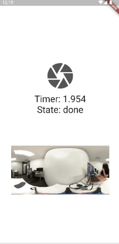
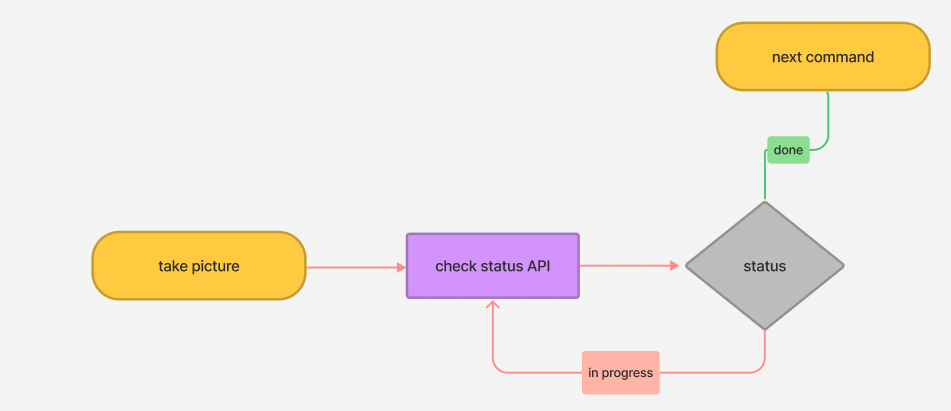
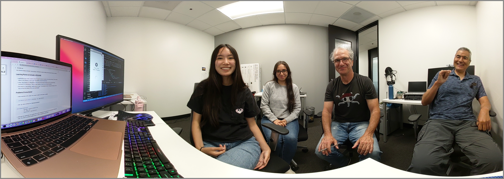

# THETA X Concept 6



After running a takePicture command, a developer must check to see if the camera is ready before issuing another command

## Concepts

The process id is parsed out when the `commands/execute` is run and then emitted to the state of the camera. Once the state is updated, the id is passed into the `commands/status` since it's a required parameter for the command to run. 



## Overview

The camera will take 3-5 seconds after a picture is taken to be ready to take another picture.  The time may vary depending on light conditions and filters.  For example, using the HDR filter will result in a longer time to be ready.  There are many scenarios where the time to execute a command will vary.  This tutorial focuses on taking a picture and then using [commands/status](https://api.ricoh/docs/theta-web-api-v2.1/protocols/commands_status/) to see if the "taking picture" process is "done".

## Steps
* take picture with commands/execute
* get command "id" of commands/execute https://api.ricoh/docs/theta-web-api-v2.1/protocols/commands_execute/


* using commands/status and the "id", get the "state" of the camera, either "inProgress" or "done"
* The `/commands/status` command needs to be in a loop with a delay between calls to `/commands/status`.  One way to add a delay in Dart is to use `Future.delayed()` - example    `Future.delayed(Duration(milliseconds: 200))`
* set up timer in Dart and start the timer when the takePicture command is run.  one possibility is to use Stopwatch class in Dart. https://api.dart.dev/be/177591/dart-core/Stopwatch-class.html (recommended, but not required)
* display the elapsed time from the point the takePicture button is pressed until the camera is ready. 
* when the camera is ready, show camera ready
* leave elapsed time on the screen for reference.  Use at least a tenth of a second accuracy

## Key Points

* application must check "camera status" to see if camera is ready for the next command.  If the camera status is not checked, THETA apps may exhibit unexpected behavior
* using `/osc/status` is a little difficult since the API command requires the "id" of the previous command it is checking on.  The developer needs to chain two commands together
* the check for `/osc/status` needs to be in a loop.  The developer needs to delay the iteration of the loop so that the camera CPU is not overloaded

## Measuring time for process to complete

To measure the time and display it on the screen, the application uses the Stopwatch class. Inside of the `CameraUseState` file, a variable called `elapsedTime` records the time that has passed on the stopwatch. When the user presses the takePicture button, the stopwatch is started in the `TakePictureEvent`.

```dart
      stopwatch.start();
```

A while loop continously adds the `CameraStatusEvent` to the `TakePictureEvent` until the image is done shooting or `state.cameraState` equals done. The delay is neccessary to give enough time for the state of the camera to change. Thus, the `elapsedTime` variable is updated every 200 milliseconds and the UI changes in tandem.

```dart
      while (state.cameraState != "done") {
          add(CameraStatusEvent());

          await Future.delayed(Duration(milliseconds: 200));
          emit(CameraUseState(
              id: id,
              message: response.bodyString,
              elaspedTime: stopwatch.elapsedMilliseconds.toDouble(),
              cameraState: state.cameraState));
        }
```

Outside of the while loop, once the camera is finished taking the picture, the stopwatch is reset.

```dart
stopwatch.stop();
        stopwatch.reset();
```

## Response Window

Similar to previous apps, the thumbnail is inside of a ternary operator and is shown if the `cameraState` equals done and there is a `fileUrl`. The thumbnail image is wrapped with an `InkWell` widget that routes to another screen when pressed. This screen shows the image in full view using the [Panorama](https://pub.dev/packages/panorama) package, also found in a previous tutorial.

```dart
state.cameraState == 'done' && state.fileUrl.isNotEmpty
                          ? InkWell(
                              onTap: () {
                                Navigator.push(
                                    context,
                                    MaterialPageRoute(
                                        builder: (context) => FullImageScreen(
                                            fileUrl: state.fileUrl)));
                              },
                              child:
                                  Image.network('${state.fileUrl}?type=thumb'))
```

The ternary operator is a nested ternary operator. If the `cameraState` is not equal to done it checks if the `cameraState` is equal to inProgress. It returns a loading widget from [SpinKit](https://pub.dev/packages/flutter_spinkit) if true. Else, the response displays a Container widget.

```dart
   : state.cameraState == 'inProgress'
                              ? SpinKitFadingCircle(
                                  size: 100.0,
                                  color: Color.fromARGB(255, 208, 206, 206),
                                )
                              : Container()
```

Here is a test image taken with the application:



## Additional Information on Application

[Problems Encountered](docs/problems.md)